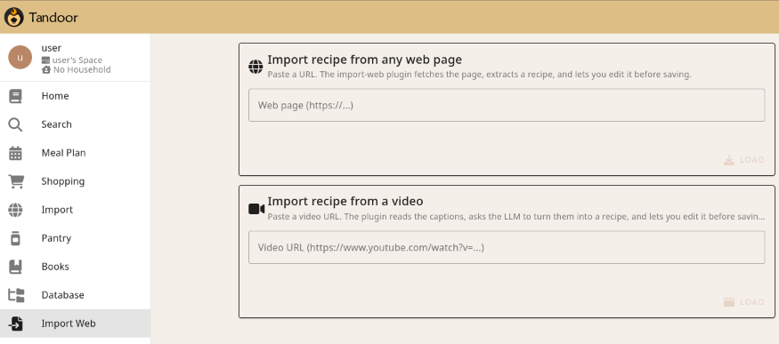

# Tandoor-import-web

A python/typescript plugin for Tandoor recipe. The importer is accessible through the sidebar.

- Import recipes from more websites than the default importer supports.
- Supports recipes from yt videos (as long as they have subtitles available).
- Capable of working around common WAF.

## Installation

First, clone the repo on your server drive.

### Docker setup

- Add two volume mounts (can be made read-only):
  - ./import_web:/opt/recipes/recipes/plugins/import_web
  - ./vue3-plugins:/opt/recipes/vue3/src/plugins
- Add one environment variable:
  - PLUGINS_BUILD=1
- Restart the container.
- Tested to work with the default app available in Truenas scale.

### Non-docker setup

- Copy import_web into recipes/recipes/plugins/
- Copy vue3-plugins into recipes/vue3/src/plugins
- Add one environment variable:
  - PLUGINS_BUILD=1

### Video imports additional setup

Uses yt-dlp to download subtitles from videos. The recipe is then generates by AI. Requires access to an OpenAI-compatible endpoint. Add the following environment variables:
- IMPORT_WEB_LLM_BASE_URL, e.g. https://provider/v1
- IMPORT_WEB_LLM_MODEL, e.g. qwen3.8:27b
- IMPORT_WEB_LLM_API_KEY, optional for local endpoints
- GUNICORN_TIMEOUT=240, to avoid timeout when processing a video
